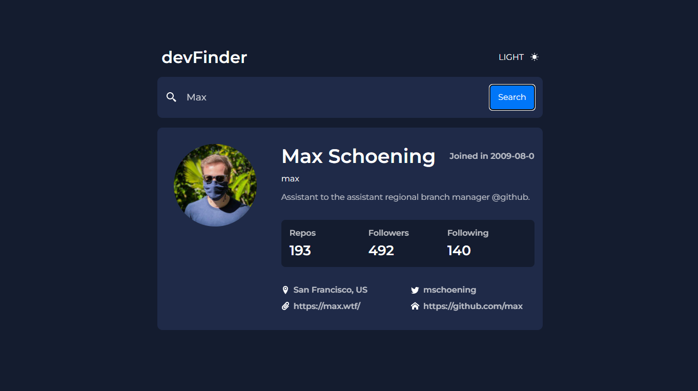
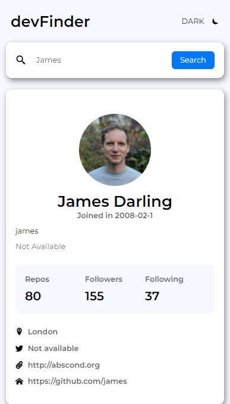

 
  

 
  

<h1 align="center">Git Finder</h1>

  <a href="#dart-about">About</a> &#xa0; | &#xa0; 
  <a href="#rocket-technologies">Technologies</a> &#xa0; | &#xa0;
  <a href="#memo-license">License</a> &#xa0; | &#xa0;
  <a href="https://github.com/LuKezLima" target="_blank">Author</a>

 

## :dart: About ##

This is a web application created to find the most relevants informations about any github user.
You can choose a dark theme or light theme. 

## :rocket: Technologies ##

The following tools were used in this project:

- [React](https://pt-br.reactjs.org/)
- API Github
- Styled Components
- Theme Switch (Dark, Light)

## :memo: License ##

This project is under license from MIT. For more details, see the [LICENSE](LICENSE.md) file.

Made with :heart: by <a href="https://github.com/LuKezLima" target="_blank">Lucas Lima</a>

&#xa0;

<a href="#top">Back to top</a>
